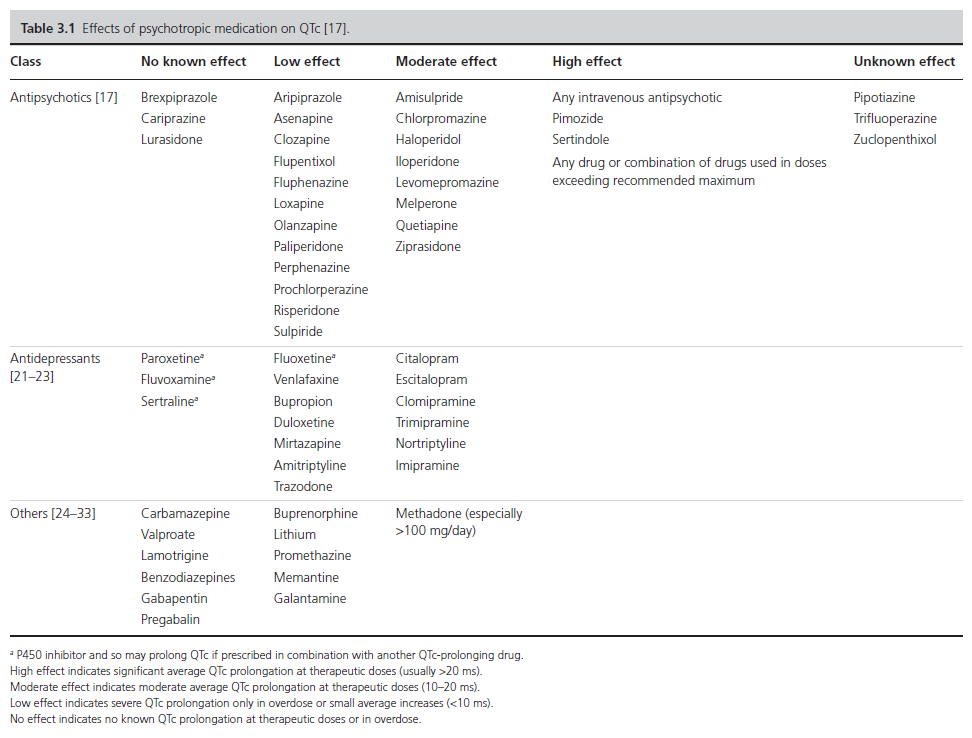
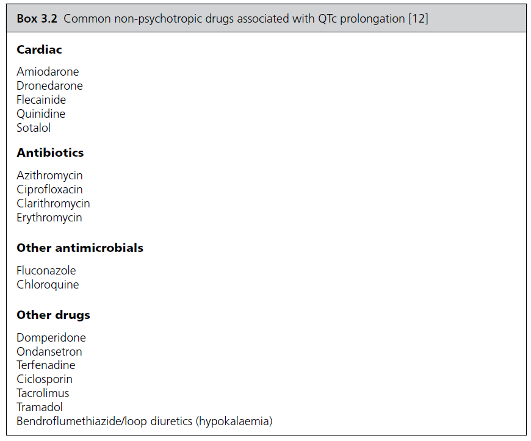
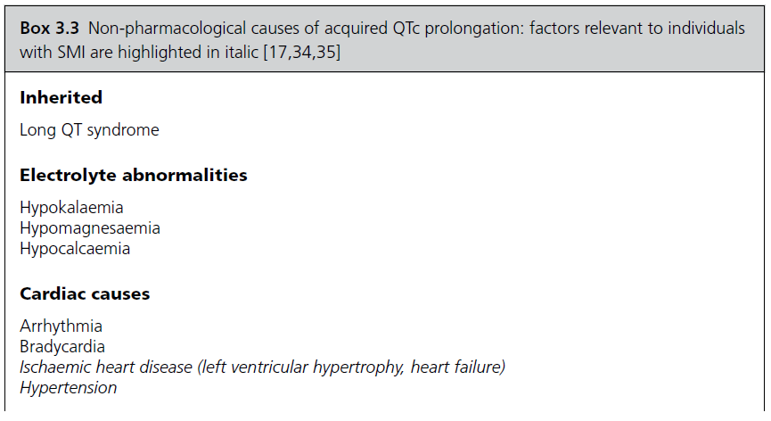
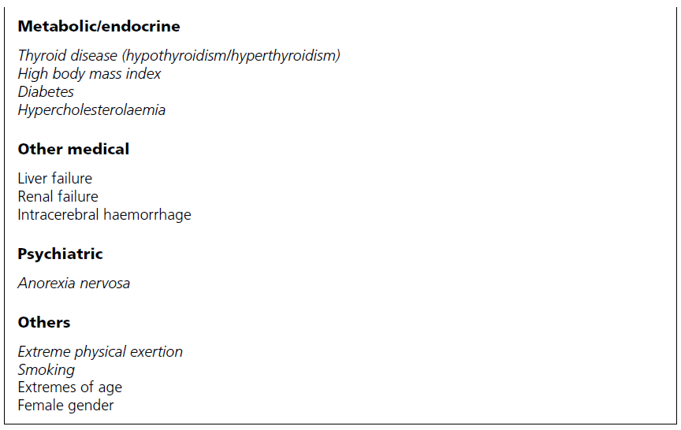
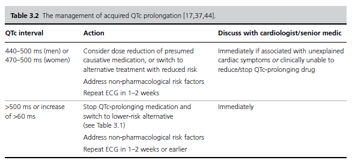

Title         : Approach to QTc Prolongation
Author        : Dr. Jagdish Varma
Affiliation   : Professor of Psychiatry, Bhaikaka University, Karamsad
Toc Depth     : 6

[TITLE]

[TOC]

# Outline

## Prescribing, screening, and monitoring

- Avoid QTc prolonging medication if possible
- Use lowest effective dose
- Avoid polypharmacy
- Assess cardiovascular risk and consider need for screening ECG
- Consult cardiologist if in doubt

## Assessment

- Screen for symptoms of arrhythmia
- Identify pharmacological and non‐pharmacological causes
- Assess cardiovascular risk
- Bloods plus ECG (with or without 24‐hour tape/echocardiogram)

## Management

- Consider stopping or reducing dose of offending drugs
- Address non‐pharmacological risk factors
- Monitor proactively
- 🚩 Refer to cardiologist if:
  - more than 500 ms or more then 60 ms increase
  - associated with history suggestive of arrhythmia
  - prior cardiac event
  - unable to stop or reduce medication

# Understanding QTc
- **Males : > 440ms**
- **Females : > 470ms**
- Increased QTc (**more than 500ms**) -> RF for Torsades -> Sudden cardiac death
- Inherited (rare)
- Acquired (8% of psychiatric patient)
- MCC Acquired = Medications
- esp. IV antipsychotics + CYP 450 inhibitors (Fluvox, FXN, PXN)

## Psychotropic medications and QTc

## Non-psychotropic medications and QTc

## Non-pharmacological causes of prolonged QTc

# Prescribing QTc prolonging medications

- Avoid QTc prolonging medication if possible
- Use lowest effective dose
- Avoid polypharmacy
- Assess cardiovascular risk and consider need for screening ECG
- Consult cardiologist if in doubt

# Assessment
- QTc prolongation should be suspected in any individual presenting with symptoms suggestive of arrhythmia (e.g. palpitations or unexplained collapse)
- The diagnosis may also be made on a screening ECG or as an incidental finding
- A detailed assessment as follows need to be carried out once diagnosed

## History

### Cardiac symptoms
- Palpitations
- Syncope
- Dizziness / Lightheadedness
- Chest pain
- SOB

### Etiologic history
- **Non-pharmacologic conditions**
  - Electrolyte disturbances: diarrhoea, vomiting, malnutrition, and eating disorder
  - Cardiovascular conditions: history of CVD, smoking, obesity, diabetes mellitus, hypertension, and hypercholesterolaemia.
  - Cardiac events: ventricular tachyarrhythmia, TdP, cardiac arrest
  - Other medical conditions: Liver failure, renal failure, Thyroid
- **Drugs and substance use**
  - drug h/o including possible deliberate or accidental overdose.
  - Alcohol, smoking

### F/H/O
- Sudden cardiac death

## Examination
- CVS
  - Inspection: high or low BMI, peripheral oedema, raised jugular venous pressure
(heart failure).
  - Palpation: pulse (regularity plus rate).
  - Auscultation: murmurs or added sounds (heart failure/left ventricular hypertrophy), pulmonary oedema.
  - Palpation for pedal/sacral oedema (heart failure, renal failure).
  - Lying and standing blood pressure if history of presyncope/syncope.

## Investigations
- Blood
  - CBC
  - RFT (renal failure, hypokalaemia, hypomagnesaemia, hypocalcaemia)
  - LFT (liver failure)
  - Lipid profile (hypercholesterolaemia)
  - TFT (hyperthyroidism/hypothyroidism)
  - Antipsychotic plasma levels (toxicity)
  - BNP (if history suggestive of heart failure).
  - ECG +- ECHO and HOLTER

# Management

# Reference
1. Pillinger T, Gaughran F, Taylor D. The Maudsley Practice Guidelines for Physical Health Conditions in Psychiatry. 2020.
