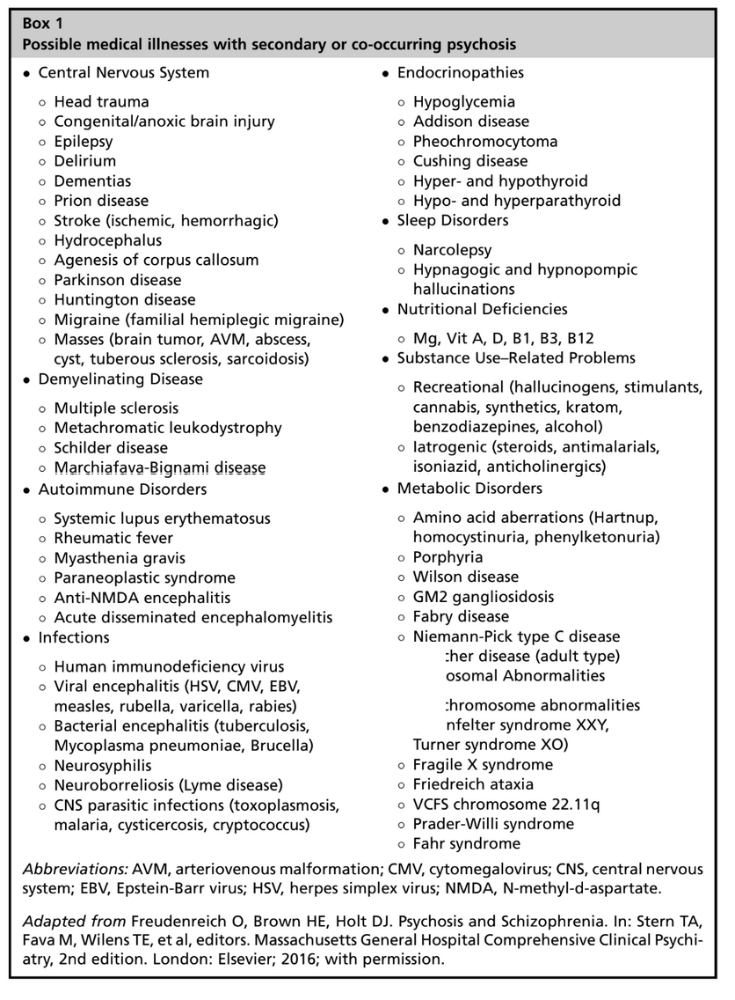
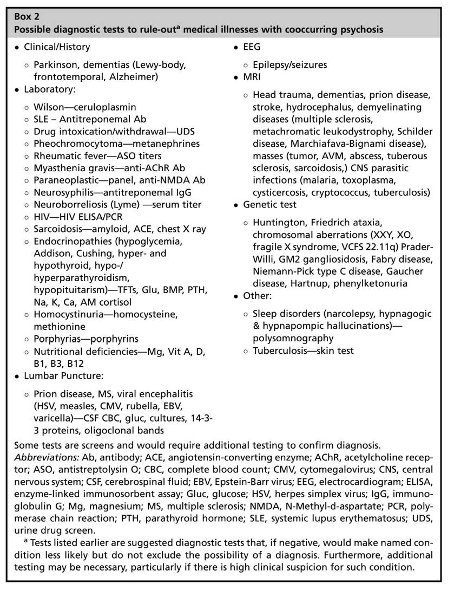

First Episode Psychosis 

# Differential diagnosis of FEP

| Primary Psychosis and Other Psychiatric Disorders |
| --- |
| \- Schizophrenia \- Other Psychotic spectrum disorders: attenuated psychotic disorder, brief psychotic disorder, schizophreniform disorder  \- Delusional disorder  \- Schizoaffective disorder  \- Mood disorders: Bipolar, MDD with psychotic features  \- PTSD \- Dissociative identity disorder  \- Personality disorders: paranoid, schizotypal, schizoid, borderline \- Eating disorder: anorexia nervosa |
| Secondary Psychosis |
| \- Substance induced  \- Associated with another medical condition - Delirium |

# Plethora of causes associated with secondary psychosis

# Possible diagnostic test to rule out medical illnesses

How to select appropriate tests in a given case?

# First tier testing - MIST causes

- MIST = Metabolic, Infective, Structural, Toxic

## Metabolic

- CMP (Comprehensive metabolic panel)
- TSH
- ANA
- Ceruloplasmin

## Infective

- CBC
- Urine-R/M
- HIV
- Syphilis

## Structural (Neurological / systemic)

- ROS
- Physical exam
- CT/MRI
- EEG

## Toxic / Defn

- Urine toxicology
- Vit B12, D

## Baseline for monitoring

- ECG
- RBS, HbA1c
- Lipid
- UPT

# Second tier testing

## Consider biography

- **Age < 13 at onset**
    - Genetic testing and MRI
- **Age > 45 at onset**
    - MRI
- **Living in old homes**
    - Lead levels as old plumbing may contain lead
- **Occupation**
    - **Lead predisposing**
        - Plumbing, mechanic, construction, glass production, metal production, battery workshop, explosives and ammunition, ceramic, surgical equipment production
        - Lead levels
    - **Mercury predisposing**
        - Waste disposal, gold, metal production, batteries, cement, explosives, dental, electronics
        - Mercury levels
    - **Arsenic predisposing**
        - Work with zinc and copper ore, farmers, well water
        - Arsenic level

## Developmental progress

- **Pt having neurodevelopmental delay or neurodegenerative symptoms? **
    - Coarse facial features, cataract, corneal clouding, cherry red spot, hearing issues, alopecia or abnormal hair, hepatic or renal enlargement, hepatomegaly or hepatosplenomegaly, skeletal dysplasia, cerebellar signs, developmental delay
- **Specific features to look for**
    - **GM2 gangliosidosis aka Tay Sachs disease** - cherry red spot on retina
    - **Fabry’s disease** - febrile, angiokeratoma and burning pain
    - **Niemann pick disease type C** - vertical supranuclear gaze palsy, childhood dementia, cholesterol
    - **Gaucher’s dz** - hepatosplenomegaly
    - **Digiorge’s syndrome** - long face, cleft palate
    - **Metachromatic leukodystrophy** - White matter dystrophy on MRI
    - **Hunter’s disease** - coarse face, deafness, large tongue
    - **Hurler’s disease** - coarse face, clouded eyes, stubby fingers
- **Testing**
    - MRI and genetic testing
- **Mnemonic for lysosomal storage diseases** “Fabry’s game not too kind, makes him hide”
    - Fabry’s disease
    - Gaucher’s disease
    - Niemann pick disease type C
    - Tay sachs disease (GM2 Gangliosidosis)
    - Krabbe’s disease
    - Metachromatic leukodystrophy (MLD)
    - Hunter’s disease
    - Hurler’s disease

## Diet

- **Homeless and malnourished** -> Mg, Vit A, B1, B3, B12
- **Veg** -> Mg, Vit A, B1, B3, B12
- **Non-veg (undercooked meat)** -> Toxoplasma antibodies
- **Non-veg (fish)** -> Mercury level

## Pets

- Toxoplasma antibodies

## Patterns to look for on ROS

- **Neurologic**
    - **Staring spells, episodic LOC, myoclonic jerks**
        - EEG
    - **Recent onset seizures**
        - MRI, paraneoplastic panel, EEG in alcoholic (SESA syndrome)
    - **Hypnopompic / Hypnogogic hallucinations**
        - Sleep study
    - **Waxing and waning neurological symptoms**
        - MRI (multiple sclerosis)
    - **Global confusion, opthalalmoplegia, ataxia, nystagmus in alcoholic**
        - MRI (Marchiafava - Bignamy, Korsakoff syndrome)
    - **Wacky, Wobbly and Wet**
        - MRI (hydrocephalus)
    - **Headache, Projectile vomiting ± Fever**
        - MRI, EEG, CSF (Meningitis, ADEM, elevated ICP)
- **Systemic**
    - **Thyroid - Weight change, hair loss, constipation, cold intolerance, Heat intolerance, tremors**
        - may also develop seizures and AMS
        - TSH, FT4, Anti-TPO, USG-Thyroid, MRI if suspecting central causes
    - **Hyperadrenal - GI symptoms, fatigue, muscle weakness, low BP, hyperpigmentation**
        - incr K+, low Na+, AM cortisol
    - **Headache, palpitations, sweating / flushing, incr. BP**
        - Metanephrines (Pheochromocytoma)
    - **Parathyroid - Bones, stones, groans and psychic moans**
        - Abdo. pain, GI symptoms, Renal stones, bone and joint pain, fatigue
        - PTH, Phosphorus (Hyperparathyroid)
    - **Fever / Sore-throat / recent ear infection**
        - ASO titer (PANDAS)
    - **Wt loss, fatigue, night sweats, incr. Ca++**
        - MRI, onco consult (sarcoidosis, Ca)
    - **Fatigue, dizziness, tingling, weakness, paleness**
        - Homocystiene
    - **Recent or multiple prior blood clots**
        - Antiphospholipid Ab
    - **Skin lesions, abdo. pain, dark urine**
        - Serum porphyrin
    - **Skin lesions, small jt paints, morning stiffness**
        - ANA, ASO

## Exam guided

- **General**
	- **Tall, thin, marfanoid**
		- Serum homocysteine (homocystinuria)
	- **Immunocompromised + Flu like symptoms**
		- Toxoplasma Ab
	- **Facial appearance**
		- **Abnormal face, cleft palate (small low set ears, wide set eyes)**
			- genetic testing (Digeorge syndrome)
		- **KF rings on Slit Lamp**
			- Ceruloplasmin (Wilson disease)
		- **Mouth ulcers**
			- deficiencies
			- Behcets disease (pathergy test)
	- **Cardiorespiratory**
		- **Increased BP, Headaches**
			- Metanephrine, urine VMA (Pheochromocytoma)
		- **Snoring + STOP BANG screen**
			- sleep study (OSA)
	- **MSK**
		- **Jt pain, swelling with or without skin lesions**
			- SLE, Porphyria (ANA, ESR, porphyrins)
	- **Skin**
		- **Mees lines (transverse white lines on nails)**
			- urine metalloproterins (arsenic poisoning)
		- **Skin discoloration, desquamation**
			- Mercury
		- **Erythma nodosum, sores, disfiguring nodules - Sarcoid**
			- W > M (MRI)
		- **Facial small nodules, white pathces on back**
			- facial angiofibroamas, ash leaf spots
			- TSC (MRI, genetic testing)
		- **Port-wine stain**
			- Struge-Weber
		- **Six or more coffee colored spots**
			- Neurofibromatosis
- **Neuro exam**
	- **Irrelevant speech** 
		- MRI (Wernickes)
	- **Sensory changes - vision, hearing, smell**
		- Neurosarcoid (MRI)
	- **Unilateral mydriasis**
		- TLE (EEG), migraines
	- **Pupils accommodate but do not react to light**
		- Syphilis (FTA-ABS)
	- **Supranuclear gaze palsy**
		- Niemann pick disease type C (genetic testing)
		- PSP (MRI)
	- **Mycolonus / seizures**
		- Hashimoto (AntiTPO)
		- Encephalitis - viral paraneoplastic (LP, NMDAR)
		- Marchiafava-Bignami, Leukodystrophy, gangliodosis, prion disease (LP, MRI)
	- **Choreiform movements**
		- Huntington disease (genetic testing)
	- **Asymmetric focal findings**
		- MS, tumor, stroke, abscess, sarcoid (MRI)

# Reference:

1.  [https://books.google.co.in/books?id=8n7ADwAAQBAJ&newbks=1&newbks\_redir=0&printsec=frontcover&dq=psychosis+in+children+and+adolescents&hl=en&redir\_esc=y#v=onepage&q=psychosis in children and adolescents&f=false](https://books.google.co.in/books?id=8n7ADwAAQBAJ&newbks=1&newbks_redir=0&printsec=frontcover&dq=psychosis+in+children+and+adolescents&hl=en&redir_esc=y#v=onepage&q=psychosis%20in%20children%20and%20adolescents&f=false)