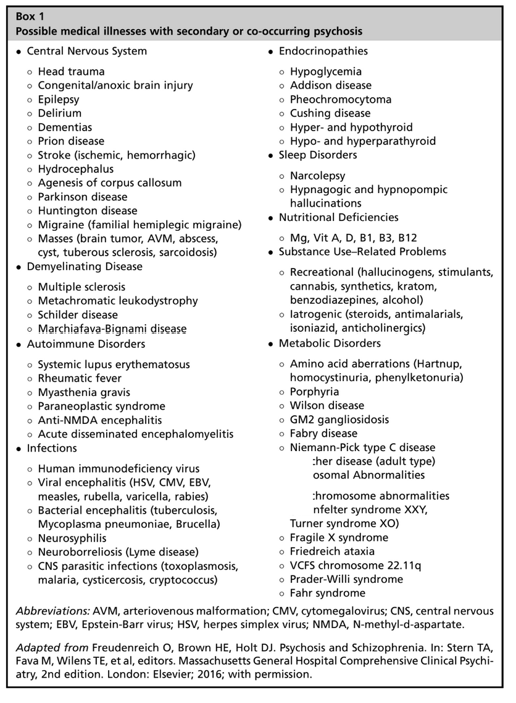
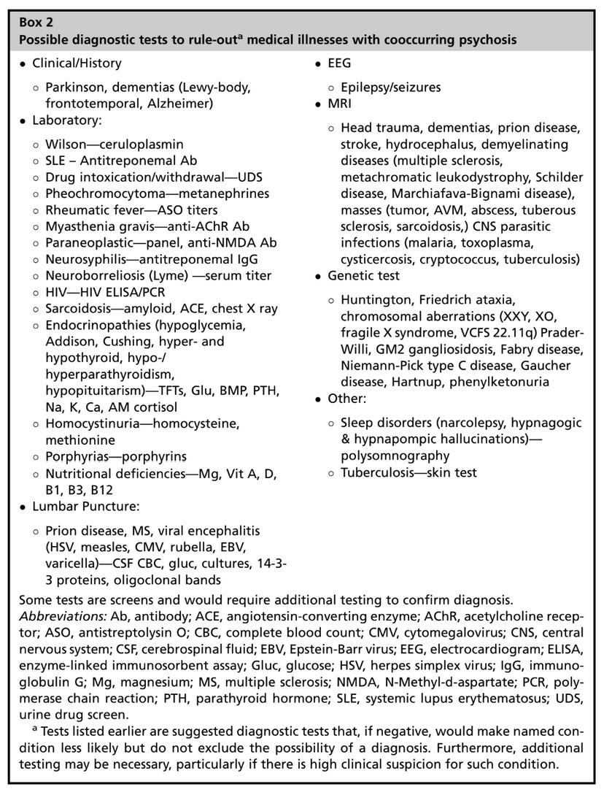

First Episode Psychosis 

# Differential diagnosis of FEP

| Primary Psychosis and Other Psychiatric Disorders |
| --- |
| \- Schizophrenia \- Other Psychotic spectrum disorders: attenuated psychotic disorder, brief psychotic disorder, schizophreniform disorder  \- Delusional disorder  \- Schizoaffective disorder  \- Mood disorders: Bipolar, MDD with psychotic features  \- PTSD \- Dissociative identity disorder  \- Personality disorders: paranoid, schizotypal, schizoid, borderline \- Eating disorder: anorexia nervosa |
| Secondary Psychosis |
| \- Substance induced  \- Associated with another medical condition - Delirium |

# Plethora of causes associated with secondary psychosis

# Possible diagnostic test to rule out medical illnesses

How to select appropriate tests in a given case?

# First tier testing - MIST causes

- MIST = Metabolic, Infective, Structural, Toxic

## Metabolic

- CMP (Comprehensive metabolic panel)
- TSH
- ANA
- Ceruloplasmin

## Infective

- CBC
- Urine-R/M
- HIV
- Syphilis

## Structural (Neurological / systemic)

- ROS
- Physical exam
- CT/MRI
- EEG

## Toxic / Defn

- Urine toxicology
- Vit B12, D

## Baseline for monitoring

- ECG
- RBS, HbA1c
- Lipid
- UPT

# Second tier testing

## Consider biography

### Age < 13 at onset

- Genetic testing and MRI

### Age > 45 at onset

- MRI

### Living in old homes

- Lead levels as old plumbing may contain lead

### Occupation

#### Lead predisposing

- Plumbing, mechanic, construction, glass production, metal production, battery workshop, explosives and ammunition, ceramic, surgical equipment production
- Lead levels

#### Mercury predisposing

- Waste disposal, gold, metal production, batteries, cement, explosives, dental, electronics
- Mercury levels

#### Arsenic predisposing

- Work with zinc and copper ore, farmers, well water
- Arsenic level

## Developmental progress

- Pt having neurodevelopmental delay or neurodegenerative symptoms?
- MRI and genetic testing

#### Screening features

- Coarse facial features, cataract, corneal clouding, cherry red spot, hearing issues, alopecia or abnormal hair, hepatic or renal enlargement, hepatomegaly or hepatosplenomegaly, skeletal dysplasia, cerebellar signs, developmental delay

#### Mnemonic for lysosomal storage diseases "Fabry's game not too kind, makes him hide"

- Fabry's disease
- Gaucher's disease
- Niemann pick disease type C
- Tay sachs disease (GM2 Gangliosidosis)
- Krabbe's disease
- Metachromatic leukodystrophy (MLD)
- Hunter's disease
- Hurler's disease

#### Specific features to look for

- **GM2 gangliosidosis aka Tay Sachs disease** \- cherry red spot on retina
- **Fabry's disease** \- febrile, angiokeratoma and burning pain
- **Niemann pick disease type C** \- vertical supranuclear gaze palsy, childhood dementia, cholesterol
- **Gaucher's dz** \- hepatosplenomegaly
- **Digiorge's syndrome** \- long face, cleft palate
- **Metachromatic leukodystrophy** \- White matter dystrophy on MRI
- **Hunter's disease** \- coarse face, deafness, large tongue
- **Hurler's disease** \- coarse face, clouded eyes, stubby fingers

## Diet

- Homeless and malnourished -> Mg, Vit A, B1, B3, B12
- Veg -> Mg, Vit A, B1, B3, B12
- Non-veg (undercooked meat) -> Toxoplasma antibodies
- Non-veg (fish) -> Mercury level

## Pets

- Toxoplasma antibodies

## Patterns to look for on ROS

### Neurologic

#### Staring spells, episodic LOC, myoclonic jerks

- EEG

#### Recent onset seizures

- MRI, paraneoplastic panel, EEG in alcoholic (SESA syndrome)

#### Hypnopompic / Hypnogogic hallucinations

- Sleep study

#### Waxing and waning neurological symptoms

- MRI (multiple sclerosis)

#### Global confusion, opthalalmoplegia, ataxia, nystagmus in alcoholic

- MRI (Marchiafava - Bignamy, Korsakoff syndrome)

#### Wacky, Wobbly and Wet

- MRI (hydrocephalus)

#### Headache, Projectile vomiting +- Fever

- MRI, EEG, CSF (Meningitis, ADEM, elevated ICP)

### Systemic

#### Thyroid - Weight change, hair loss, constipation, cold intolerance, Heat intolerance, tremors

- may also develop seizures and AMS
- TSH, FT4, Anti-TPO, USG-Thyroid, MRI if suspecting central causes

#### Hyperadrenal - GI symptoms, fatigue, muscle weakness, low BP, hyperpigmentation

- incr K+, low Na+, AM cortisol

#### Headache, palpitations, sweating / flushing, incr. BP

- Metanephrines (Pheochromocytoma)

#### Parathyroid - Bones, stones, groans and psychic moans

- Abdo. pain, GI symptoms, Renal stones, bone and joint pain, fatigue
- PTH, Phosphorus (Hyperparathyroid)

#### Fever / Sore-throat / recent ear infection

- ASO titer (PANDAS)

#### Wt loss, fatigue, night sweats, incr. Ca++

- MRI, onco consult (sarcoidosis, Ca)

#### Fatigue, dizziness, tingling, weakness, paleness

- Homocystiene

#### Recent or multiple prior blood clots

- Antiphospholipid Ab

#### Skin lesions, abdo. pain, dark urine

- Serum porphyrin

#### Skin lesions, small jt paints, morning stiffness

- ANA, ASO

## Exam guided

### General

#### Tall, thin, marfanoid

- Serum homocysteine (homocystinuria)

#### Immunocompromised + Flu like symptoms

- Toxoplasma Ab

### Facial appearance

#### Abnormal face, cleft palate (small low set ears, wide set eyes)

- genetic testing (Digeorge syndrome)

#### KF rings on Slit Lamp

- Ceruloplasmin (Wilson disease)

#### Mouth ulcers

- deficiencies
- Behcets disease (pathergy test)

### Cardiorespiratory

#### Increased BP, Headaches

- Metanephrine, urine VMA (Pheochromocytoma)

#### Snoring + STOP BANG screen

- sleep study (OSA)

### MSK

#### Jt pain, swelling with or without skin lesions

- SLE, Porphyria (ANA, ESR, porphyrins)

### Skin

#### Mees lines (transverse white lines on nails)

- urine metalloproterins (arsenic poisoning)

#### Skin discoloration, desquamation

- Mercury

#### Erythma nodosum, sores, disfiguring nodules - Sarcoid

- W > M (MRI)

#### Facial small nodules, white pathces on back

- facial angiofibroamas, ash leaf spots
- TSC (MRI, genetic testing)

#### Port-wine stain

- Struge-Weber

#### Six or more coffee colored spots

- Neurofibromatosis

## Neuro exam

#### Sensory changes - vision, hearing, smell

- Neurosarcoid (MRI)

#### Unilateral mydriasis

- TLE (EEG), migraines

#### Pupils accommodate but do not react to light

- Syphilis (FTA-ABS)

#### Supranuclear gaze palsy

- Niemann pick disease type C (genetic testing)
- PSP (MRI)

#### Mycolonus / seizures

- Hashimoto (AntiTPO)
- Encephalitis - viral paraneoplastic (LP, NMDAR)
- Marchiafava-Bignami, Leukodystrophy, gangliodosis, prion disease (LP, MRI)

#### Choreiform movements

- Huntington disease (genetic testing)

#### Asymmetric focal findings

- MS, tumor, stroke, abscess, sarcoid (MRI)

# Reference:

1.  [https://books.google.co.in/books?id=8n7ADwAAQBAJ&newbks=1&newbks\_redir=0&printsec=frontcover&dq=psychosis+in+children+and+adolescents&hl=en&redir\_esc=y#v=onepage&q=psychosis in children and adolescents&f=false](https://books.google.co.in/books?id=8n7ADwAAQBAJ&newbks=1&newbks_redir=0&printsec=frontcover&dq=psychosis+in+children+and+adolescents&hl=en&redir_esc=y#v=onepage&q=psychosis%20in%20children%20and%20adolescents&f=false)