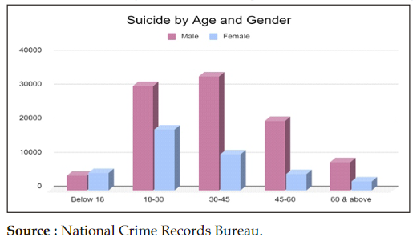

Suicide in India current status and future 

# Suicide in India current status and future 
Prepared by - Dr. Jagdish Varma, Professor of Psychiatry, Pramukhswami Medical College, Bhaikaka University, Karamsad

## Suicide as a complex phenomenon

- Suicide is a complex phenomenon, with numerous factors contributing to an individual's risk of suicide. 

## Suicide in India: Current status 
[Yadav et al, 2021](http://jndmeerut.org/wp-content/uploads/2021/07/Vol.-30-No.-1-2021.pdf#page=109) Access date 09/09/2021

-  Suicide  rates  were  found  to  be  significantly  higher  for  the  age group belonging to 18-30 years and 30-45 years.

- Contrary to previous beliefs married people accounted 66.7% of total suicides (NCRB data)
-  Higher rate of suicide among poor and low-income  group  people.

- Daily  wage  workers  alone  constitute  23.4%  of  total  suicide whereas proportion of housewives committing suicide is much more than other females.
- Most common methods used are hanging, followed by poisoning.  

## Suicide in India: An economic perspective
[Keswani et al, ?2019](https://www.researchgate.net/profile/Chirag-Jain-28/publication/353126043_Suicide_in_India_An_Economic_Perspective/links/60e85fc4b8c0d5588ce61598/Suicide-in-India-An-Economic-Perspective.pdf) Access date 09/09/2021

- As can be seen from the previous sections that suicide rates are higher amongst  low income groups and daily wagers.
- Keswani et al have reported suicide rate increases as the per capita net state domestic product increases.An increase in per capita NSDP indicates economic stagnation, while a decrease indicates economic health. This concludes that more economic stagnation leads to more suicides, and a healthier economy decreases suicide rates.
- They also noted that life expectancy, which
is an indicator of the health infrastructure, has a negative relationship with the suicide rate. 
- Finally, as the strength of the police force increases, the number of suicide decreases.

## Reasons for dying and reasons for living amongst suicide attempters 
[Beniwal et al, 2021](https://journals.sagepub.com/doi/full/10.1177/02537176211022508) Access date 09/09/2021

- Beniwal et al analyzed RFD and RFL amongst a small number of attendees of crisis intervention clinics and found thay RFD and RFL can be grouped in similar categories as shown in the figure below:

## Studies on risk factors of suicide in India

- [Holman et al, 2020](https://pubmed.ncbi.nlm.nih.gov/32522102/) studied risk factors for suicide in a Western population using a network approach. They found depression to be the most central risk factor, whereas Self-esteem and resilience were protective against suicidal ideation. 
- Whereas [Jacob et al, 2018](https://www.cambridge.org/core/journals/the-british-journal-of-psychiatry/article/risk-factors-for-suicide-in-rural-south-india/3228F85A9B252C7DF9892E4AC64432C5) have reported that psychosocial stress and social isolation, rather than psychiatric morbidity, are risk factors for suicide in rural south India.
- While [Vijayakumar et al](https://onlinelibrary.wiley.com/doi/abs/10.1111/j.1600-0447.1999.tb00985.x) using a case control study found that presence of an Axis I disorder, family history of psychopathology and recent life events were all found to be significant risk factors. And, suggested that risk factors for  completed suicide were universal across countries and cultures.

## Is India doing enough to control preventable deaths due to suicide?

[Swain et al, 2021](https://journals.plos.org/plosone/article?id=10.1371/journal.pone.0255342) Access date 09/09/2021

- Swain et al looked at the longitudinal time series data over the last 50 years—collected from the National Crime Record Bureau Reports (1969 to 2018).

 <b>Figure:</b>  Trend of suicide rate in India (from the year 1969 to year 2018).

- As shown in the figure above, there has been an rising trend of suicide rates in India over the last five decades.

 <b>Figure:</b> Forecasted plot of the suicide rate for India with 95% CI.

- The prediction model indicates a future relatively consistent pattern of suicide in India. 

## Way ahead for India
- Mental health professionals to adopt proactive and leadership roles in suicide prevention and save the lives of thousands of young Indians ([Vijayakumar, 2007](https://www.ncbi.nlm.nih.gov/pmc/articles/PMC2917089/)).
- [Jacob, 2008](https://econtent.hogrefe.com/doi/abs/10.1027/0227-5910.29.2.102) has argued for population based approaches that focus on improving the general health of populations, rather than medical, psychiatric, and other strategies that target individuals. 
	- Investment in public health care and other welfare activities like education and employment generation.
	- Implementation of decriminalization of suicide policy in true sense. 
	- Responsible media reporting of suicide related news reports. 
	- Urgent need to develop a framework to deliver mental health services to all those who attempt suicide. 
	- Inclusion of self-esteem and resilience building in school curriculum. 
- [Rane et al, 2014](https://www.ncbi.nlm.nih.gov/pmc/articles/PMC4120287/) and [Dandona et al, 2017](https://academic.oup.com/ije/article/46/3/983/2617187?login=true)  have reported deficits in the quality of the information about suicide in India. Hence, there is a felt need for better quality research on the topic of Suicide in India. e.g. Nationally representative studies investigating fatal and non-fatal suicidal behaviors, evaluation of models of service delivery for the vulnerable population ([Aggarwal, 2015](http://citeseerx.ist.psu.edu/viewdoc/download?doi=10.1.1.908.4929&rep=rep1&type=pdf)). 
