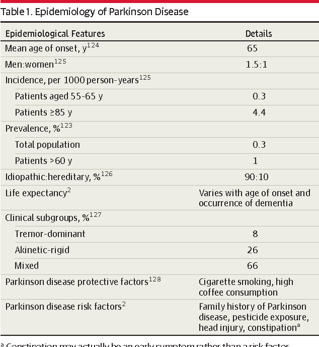
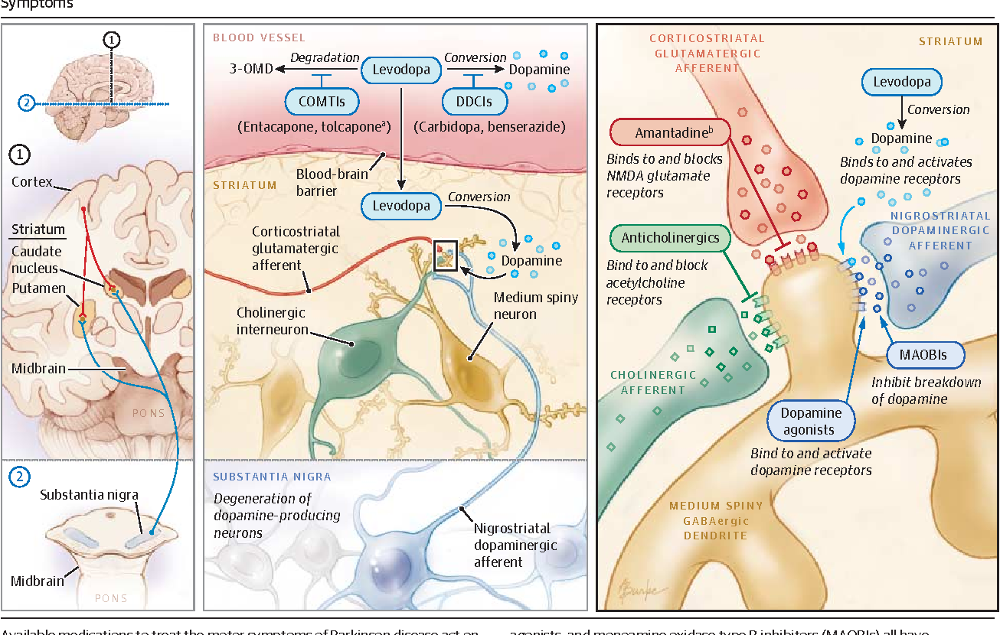
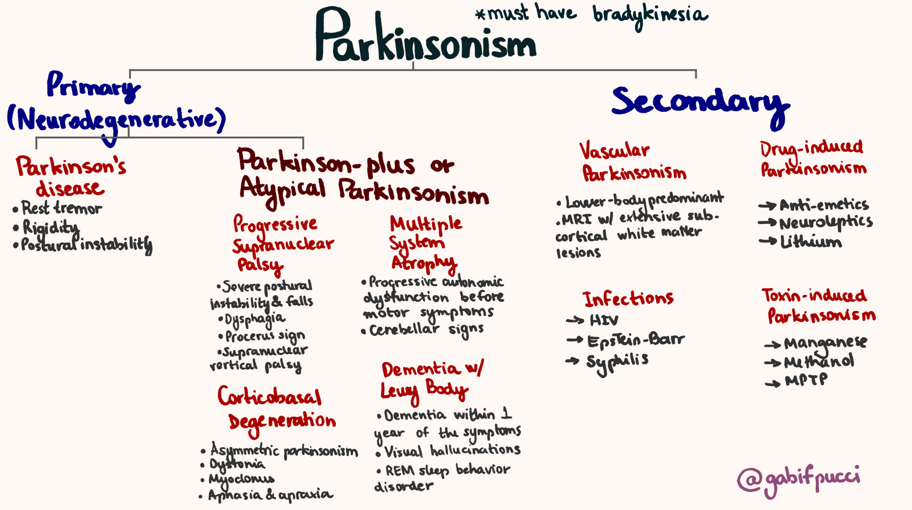
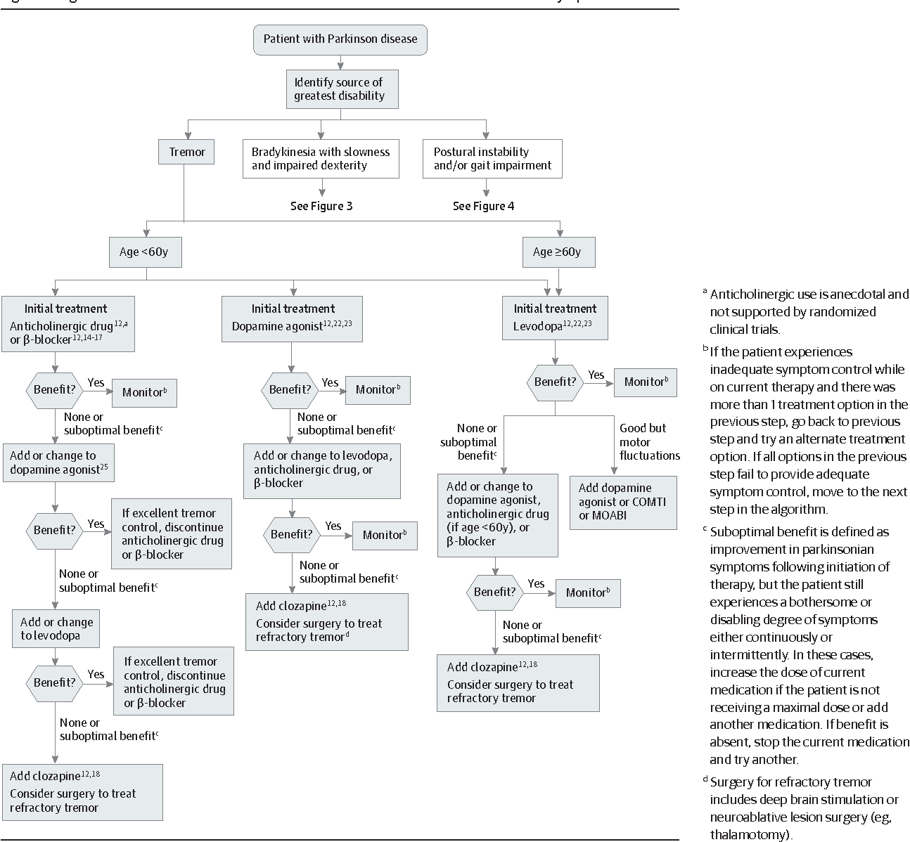
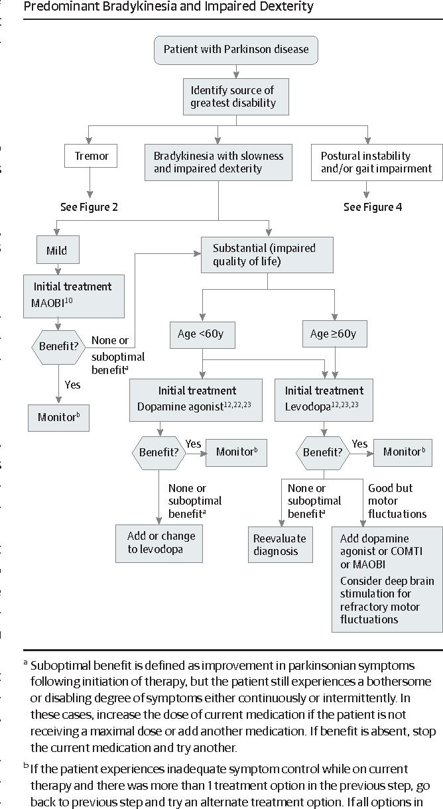
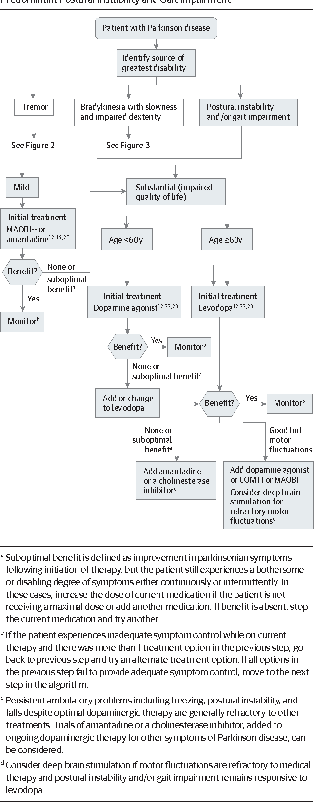
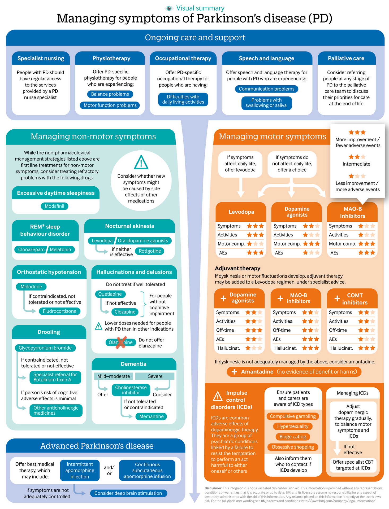

# Parkinsonism
Edit date: 26/06/2021 07:41

**CONTENTS**
* * *

- [Parkinsonism](#parkinsonism)
- [Introduction](#introduction)
- [Clinical features](#clinical-features)
  - [Motor symptoms of Parkinsonism](#motor-symptoms-of-parkinsonism)
  - [Motor symptoms of **PD** other than TRAP](#motor-symptoms-of-pd-other-than-trap)
  - [Non-motor autonomic symptoms of **PD**](#non-motor-autonomic-symptoms-of-pd)
  - [Non-motor neuropsychiatric symptoms of **PD**](#non-motor-neuropsychiatric-symptoms-of-pd)
  - [Non-motor sensory symptoms](#non-motor-sensory-symptoms)
  - [Course / Stages of PD](#course--stages-of-pd)
- [Pathophysiolgy](#pathophysiolgy)
- [DD of Parkinsonism](#dd-of-parkinsonism)
  - [First way of classifying the causes](#first-way-of-classifying-the-causes)
    - [Primary](#primary)
    - [Secondary](#secondary)
    - [PD Plus](#pd-plus)
    - [Heredodegenerative](#heredodegenerative)
- [Diagnosis of PD](#diagnosis-of-pd)
  - [History taking in akinetic-rigid patient](#history-taking-in-akinetic-rigid-patient)
  - [Examination of akinetic-rigid patient](#examination-of-akinetic-rigid-patient)
  - [Rule out PD mimics](#rule-out-pd-mimics)
  - [Clinically probable PD criteria](#clinically-probable-pd-criteria)
- [Rx](#rx)
  - [Drug classes for PD rx](#drug-classes-for-pd-rx)

* * *

# Introduction
- second mcc of tremors
- first mcc of tremors is ET
- a syndrome of multiple different etiologies
- mcc PD

# Epidemiology of PD

# Clinical features
## Motor symptoms of Parkinsonism
- TRAP (Tremor, Rigidity, Akinesia, Postural Instability)
- T - Tremors - slow 6 Hz
  - prominent at rest
  - decreased by action
  - increased by walking

- R - Rigidity
  - Tone increased leading to rigidity and cog-wheeling

- A - Akinesia
  - slowness of movement and reduced amplitude
- P - Postural instability
  - Stance - narrow base, Stooped posture
  - Festinating gait - short steps, decreased arm swing, en bloc turning

## Motor symptoms of **PD** other than TRAP
- Micrographia
- Masked facies
- Hypophonic speech

## Non-motor autonomic symptoms of **PD**
- Swallowing difficulty
- Urinary symptoms
- Sexual dysfunction
- Constipation
- Orthostatic hypotension
- Supine hypertension

## Non-motor neuropsychiatric symptoms of **PD**
- Depression
- Anxiety
- Apathy
- Psychosis
- Hallucinations
- Impulsive Compulsive behaviors
- Dementia
- Vivid dreams
- REM Sleep behaviors
- Insomnia
- RLS

## Non-motor sensory symptoms
- Sensory dysfunctions
- Pain
- Fatigue

## Course / Stages of PD

# Pathophysiolgy
- Degeneration of neurons from substantia niagra to basal ganglia
- unknown trigger of degeneration

- Pathways involved in Parkinson's disease 

# DD of Parkinsonism

## First way of classifying the causes
### Primary
- Sporadic
- Familial
- Genetic etiologies of PD
  - Onset age < 21 - atypical sx : cognitive impairment, pyramidal signs - ATP13A2, FBX07, PLA2G6
  - Onset age > 21 - slow disease progression, dopa-responsive, early motor fluctuation - PARK2, PINK1, DJ1
  - Onset age > 21 - cognitive impairment, rapid progression - SNCA
  - Onset age > 40 - typical PD - LRRK2

### Secondary
- Drugs - Antipsychotics, Metoclopramide, Procholorperazine, Valproate, Lithium, Alpha-methyldopa, SSRIs, Phenelizine, CCBs (cinnarizine, flunarizine, amlodipine), Amiodarone, Disulfiram,
- Infective - post enceph, neurosyphilis
- Vascular - Stroke
- Inflammatory - MS, SLE, Sjogren
- Nutritional, Endocrine, Metabolic - Post anoxic, Pellagra, Central pontine myelinolysis,
- Degenerative - as below
- Trauma - post head injury
- Tumor
- Structural - NPH
- Toxic - Alcohol withdrawal, Manganese, CO, MPTP, Cyanide, Methanol, OP, Inhalant abuse,

### PD Plus
- PSP, MSA, CBD, DLB, Alz, FTD with PD
- PSP
  - Stiff upper body
  - Supranuclear gaze palsy
- MSA
  - P - Parkinsonism with
  - O - orthostatic hypotension [autonomic signs]
  - C - cerebellar signs
  - C - corticospinal signs
- DLB
  - dementia with PD within 1 year of onset
  - psychosis is common
  - neuroleptic sensitivity - quetiapine may help
  - valproate may help

### Heredodegenerative
- Wilson, NBIA, Basal Ganglia Calcification, Mitochondrial
- Huntington, SCA, FXTAS, DRPLA, Dystonia-parkinsonism, neuroacanthocytosis, CJD

# Diagnosis of PD

## History taking in akinetic-rigid patient
1. Motor symptoms - TRAP
  a. Age at onset of symptoms
  b. Symmetrical / Asymmetrical

2. Etiological h/o
  a. Any exposure to neuroleptics, other drug causes?
  b. Any h/o s/o stroke, trauma, tumor, seizure?
  c. Any h/o s/o enceph?
  d. Any exposure to CO, Manganese or Heavy metals?
  e. Any falls or postural instability early in illness?
  f. Any autonomic symptoms like orthostatic hypotension?
  g. Any cognitive symptoms (aphasia, apraxia, dementia)?
  h. Any diplopia?

3. Non-motor symptoms
  a. Swallowing difficulty
  b. Constipation
  c. Urinary / Sexual dysfunction
  d. Depression, Anxiety, Psychosis, OC, Impulsive
  e. Insomnia, RLS, REM SBD

## Examination of akinetic-rigid patient
1. Appearance - Masking, speech with diminished amplitude and inflection
2. Vitals - esp. orthostatic hypotension
3. EOM - Supranuclear gaze palsy
4. Tremor - Resting, 4-5 Hz, reduce with action, worse with walking
5. Rigidity - cog-wheeling
6. Akinesia - Finger tapping on table
7. Postural instability - Stance and Gait - narrow base, shuffling, festinating, freezing, loss of arm swing, retropulsion
8. Any muscle weakness or atrophy
9. Muscle reflexes, Plantar, Gabellar tap, Reflex myoclonus, Cerebellar signs
10. stereognosis, graphesthesia
11. MSE - MMSE + CDT, digit span, category fluency, apraxia [comb hair, blow a match stick]

### Another way
- PD exam = tremor, tone, gait, posture
- PD plus exam = 
	- BP for postural fall
	- Gaze
	- Praxis [comb hair, blow a match stick]
	- Release reflexes
	- UMN signs
	- MMSE + CDT

## Rule out PD mimics
-  Hypothyroidism
- Depression
- Catatonia
- Stiff person syndrome [neuromuscular condition] - elevated CPK
- Rheumatological condition

## Clinically probable PD criteria
- Parkinsonism
- Absence of exclusion criteria
  1. Identifiable cause - various : stroke, trauma, tumor, h/o enceph, anoxia, NPH
  2. Gaze palsy - PSP
  3. Cerebellar, Autonomic signs - MSA
  4. Medicine resistance
  5. Sustained remission
  6. Oculogyric crises
  7. Dementia - DLB, Alz, FTD
  8. Babinski sign
- Balanced numbers of supportive criteria and red flags

# Rx

## Drug classes for PD rx
- Anticholinergics - Trihexyphenidyl, Benztropine
- DA agonists - ropinrole, pramipexole, pergolide
- Levodopa - with carbidopa
- COMT inhibitors - entacapone / tolcapone
- MOA inhibitors - selegiline
- Dopamine releasing agents - Amantidine

# Algorithms for treatment 

## Tremor predominant

## Predominant bradykinesia

## Predominant postural instability

## Non-motor symptoms and overall management
